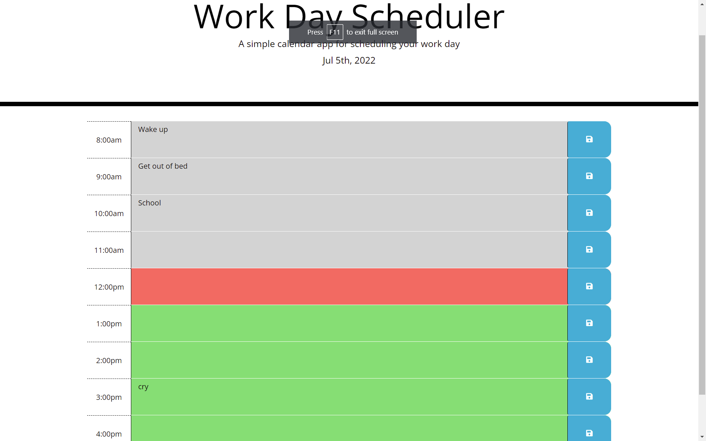

Your Average Day Planner!

From the basic script a few things were added:

* Today's date using moment.js (moment())

* Rows for the dates to the container divider placed before 

* Text boxes within the rows

* Save function on the right hand side

Here is the program running with the system time set to 12:00pm!

* To show the past, a grey color is used
* For the present, a red color is used
* For the future, a green color is used

When the save button is pressed, the items will remain even upon refresh.

## 📝 Personal Note

I used a lot of online resources for this one to make it accurate as possible. I did find
a very similar project online and didn't use it to copy but as reference to understand each part.
My biggest struggle was how to compare current time to the block times so I would say that part was
the only one fully copied. The concepts are beginning to make a lot more sense!